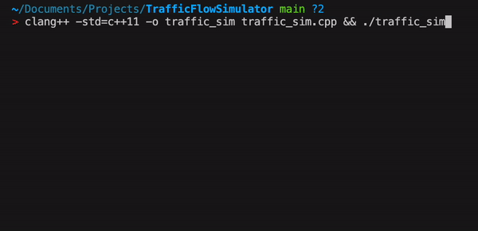

# TrafficFlowSimulator

This is a hobby project I started because I was curious as to how the traffic simulation softwares work and wanted to build a basic one just for fun.

## Demo

Here’s a quick demo of the simulation:



## What It Does

- Simulates vehicle movement on a grid-based road system with a single intersection.
- Implements traffic lights that alternate between green and red to control traffic flow.
- Provides a simple text-based visualization of roads, vehicles (`V`), and traffic lights (`G`/`R`).

## How It Works

1. **The Grid**:

   - A 20x10 grid represents the road system.
   - Vehicles (`V`) move along the roads, stopping or crossing at the intersection (`G`/`R`).

2. **Vehicles**:

   - Vehicles move in predefined directions (up or right).
   - Their movement is governed by:
     - Road boundaries.
     - Traffic light rules at the intersection.

3. **Traffic Light**:

   - Alternates every 5 steps between green (`G`) for vertical traffic and red (`R`) for horizontal traffic.
   - Vehicles stop at the intersection if the light is red for their direction.

4. **Simulation Loop**:
   - Runs for 50 steps, updating vehicle positions, toggling the traffic light, and displaying the grid at each step.

## How To Compile and Run The Code

To compile:

```bash
g++ -std=c++11 -o traffic_sim traffic_sim.cpp
```

To run:

```bash
./traffic_sim
```
